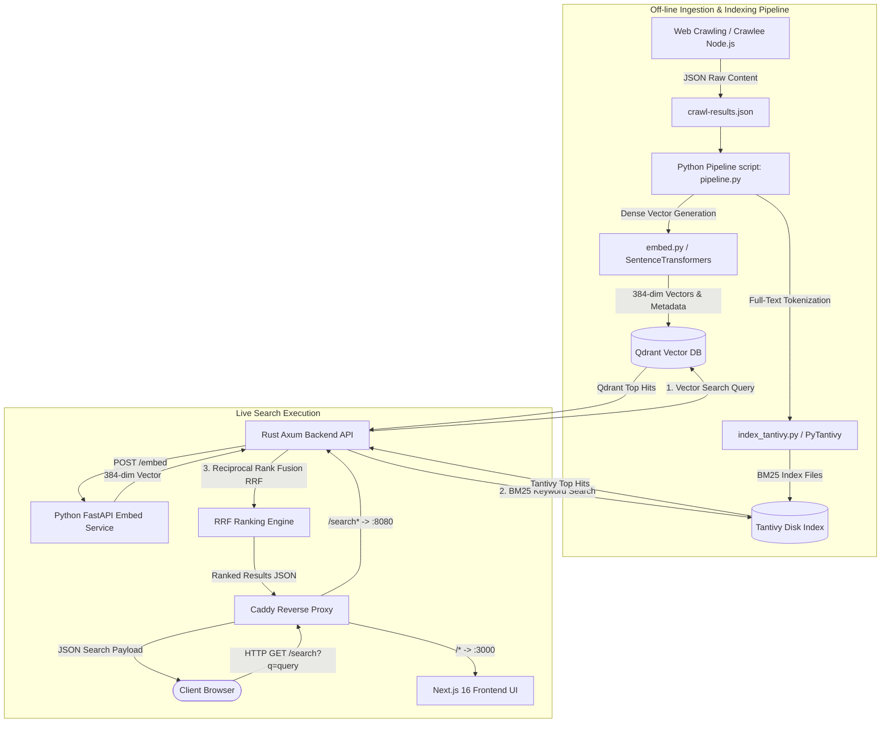
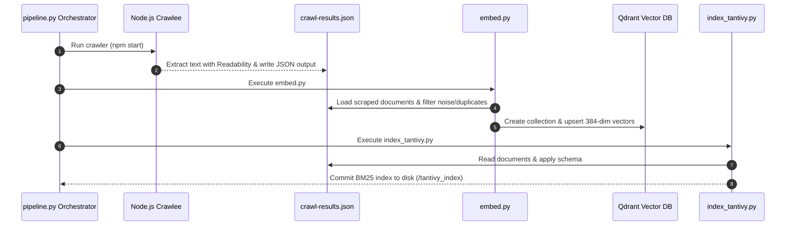

# 🪐 HoloSearchEngine — Hybrid AI & Keyword Search Engine

**HoloSearchEngine** is a high-performance, containerized hybrid search engine designed for web content. It combines **Vector Semantic Search** (powered by Sentence Transformers & Qdrant) with **BM25 Lexical Keyword Search** (powered by Tantivy in Rust) using **Reciprocal Rank Fusion (RRF)** for state-of-the-art accuracy and speed.

---

## 📐 High-Level Architecture & Data Flow



---

## 📁 Repository Folder Structure

```
HoloSearchEngine/
├── api/                        # High-performance Rust Backend Search API
│   ├── src/
│   │   └── main.rs             # Axum web server, Tantivy reader, Qdrant client, RRF fusion algorithm
│   ├── Cargo.toml              # Rust crate dependencies (Axum, Tantivy, Tokio, Reqwest, Serde)
│   └── Dockerfile              # Multi-stage Rust build & runtime image
├── crawler/                    # Headless Web Crawler (Node.js & TypeScript)
│   ├── src/
│   │   └── index.ts            # Crawlee + Cheerio crawler script targeting anime sources
│   ├── data/
│   │   └── crawl-results.json  # Output dataset generated after crawling
│   ├── package.json
│   └── tsconfig.json
├── embeded_service/            # Microservice for real-time text-to-vector embedding
│   ├── main.py                 # FastAPI application serving `all-MiniLM-L6-v2` embeddings
│   ├── requirements.txt
│   └── Dockerfile
├── frontend/                   # Modern Web Search Interface
│   └── holo-search-engine/
│       ├── app/                # Next.js App Router (Layouts & Pages)
│       ├── components/         # Search bar, results view, pagination & UI components
│       ├── package.json        # Next.js 16, React 19, Tailwind CSS v4 dependencies
│       └── Dockerfile
├── tantivy_index/              # Persistent Tantivy inverted index directory
├── Caddyfile                   # Caddy reverse proxy routing rules
├── docker-compose.yml          # Container orchestration for production & local deploy
├── embed.py                    # Standalone/Pipeline script to vectorize & populate Qdrant
├── index_tantivy.py            # Standalone/Pipeline script to index scraped data into Tantivy
├── pipeline.py                 # Python orchestrator running: Crawl -> Embed -> Index Tantivy
├── query.py                    # CLI tool for querying Tantivy directly
└── hybrid_search.py            # Python hybrid search CLI verification tool
```

---

## 🛠️ Technology Stack Breakdown

| Component | Technology / Library | Purpose & Details |
| :--- | :--- | :--- |
| **API Backend** | **Rust (Axum + Tokio)** | Ultra-fast multi-threaded HTTP web server providing search endpoints, performing concurrent Qdrant & Tantivy queries and ranking results via RRF. |
| **Vector DB** | **Qdrant (v1.12)** | Open-source vector database storing 384-dimensional dense vectors with Cosine similarity search. |
| **Lexical Index** | **Tantivy (Rust)** | High-performance full-text search engine library implementing BM25 ranking. |
| **Embedding Engine** | **Python (FastAPI + Sentence-Transformers)** | Serves sentence embeddings using `all-MiniLM-L6-v2` model (384 dimensions). |
| **Web Crawler** | **Node.js, TypeScript, Crawlee, Readability** | CheerioCrawler to fetch, sanitize, extract text content with `@mozilla/readability`. |
| **Frontend UI** | **Next.js 16, React 19, Tailwind CSS v4** | Interactive search interface with instant query response and responsive design. |
| **Reverse Proxy** | **Caddy v2** | Edge reverse proxy routing `/search` requests to Rust API and root requests to Next.js. |
| **Containerization** | **Docker & Docker Compose** | Complete multi-service orchestration with persistent volumes. |

---

## 🧠 System Architecture & Feature Mechanics

### 1. Hybrid Search Architecture
HoloSearchEngine solves the limitations of using vector-only or keyword-only search engines:
- **Vector Search (Semantic Understanding):** Understands context, synonyms, and intent (e.g., query *"superhero punch man"* matches *"One Punch Man"*).
- **BM25 Keyword Search (Exact Precision):** Captures exact names, codes, titles, and unique terminology (e.g., query *"Fullmetal Alchemist"* matches exact title hits).

### 2. Reciprocal Rank Fusion (RRF)
Search results from Qdrant and Tantivy are combined using the **Reciprocal Rank Fusion** algorithm with a constant $k = 60$:

$$\text{RRF\_Score}(d) = \sum_{m \in M} \frac{1}{k + r_m(d)}$$

Where:
- $M$ is the set of search systems ($\text{Qdrant}$, $\text{Tantivy}$).
- $r_m(d)$ is the 1-based rank position of document $d$ in search system $m$.
- Documents appearing at top positions in both systems receive exponentially higher final RRF scores.

### 3. Data Processing & Ingestion Pipeline Flowchart



---

## 🔌 API Endpoint Documentation

### Base URL
When running via Docker Compose / Caddy: `http://localhost/search`  
When running Rust API directly: `http://localhost:8080/search`

---

### `GET /search`
Performs a hybrid search query across both Qdrant and Tantivy indices, returning RRF-fused results.

#### Query Parameters

| Parameter | Type | Default | Required | Description |
| :--- | :--- | :--- | :--- | :--- |
| `q` | `string` | - | **Yes** | The search query string (e.g., `naruto`, `space cowboy`). |
| `page` | `integer` | `1` | No | Page number (1-indexed, minimum: 1). |
| `page_size` | `integer` | `10` | No | Number of items per page (range: 1 - 50). |

#### Request Example
```bash
curl -X GET "http://localhost/search?q=cowboy%20bebop&page=1&page_size=5"
```

#### Response Payload (`200 OK`)
```json
{
  "results": [
    {
      "title": "Cowboy Bebop - MyAnimeList.net",
      "url": "https://myanimelist.net/anime/1/Cowboy_Bebop",
      "excerpt": "Enter a world of bounty hunters in space...",
      "rrf_score": 0.03278688524590164,
      "qdrant_score": 0.8124,
      "tantivy_score": 14.8213
    }
  ],
  "total": 1,
  "page": 1,
  "page_size": 5,
  "total_pages": 1,
  "query": "cowboy bebop"
}
```

---

### Embedding Microservice API (`http://localhost:8000`)

#### `POST /embed`
Generates vector representation of input text.
- **Request Body:** `{"text": "your query string"}`
- **Response:** `{"vector": [0.012, -0.045, ... 384 dimensions]}`

#### `GET /health`
Returns service status and active sentence transformer model details.

---

## 🚀 Local Development Setup & Execution Guide

### Prerequisites
- [Docker](https://www.docker.com/) & [Docker Compose](https://docs.docker.com/compose/)
- [Node.js 18+](https://nodejs.org/) (for manual crawler running)
- [Python 3.10+](https://www.python.org/) & [Rust toolchain](https://www.rust-lang.org/) (for standalone development)

### Quick Start with Docker (Recommended)

1. **Clone the repository:**
   ```bash
   cd C:\Users\Lenovo\Desktop\searchengine\HoloSearchEngine
   ```

2. **Run ingestion pipeline to populate data indices:**
   ```bash
   # Crawl content, generate vector embeddings and build Tantivy index
   python pipeline.py
   ```

3. **Launch all services via Docker Compose:**
   ```bash
   docker-compose up -d --build
   ```

4. **Access the application:**
   - **Frontend UI:** `http://localhost`
   - **Search API:** `http://localhost/search?q=hunter`
   - **Qdrant Dashboard:** `http://localhost:6333/dashboard`

---

## ☁️ Future Cloud Deployment Plan (No Credit Card Required / Deferred)

> **Note:** The deployment step can be executed whenever cloud credits or a deployment platform are selected. Below is the blueprint for deployment:

### Free / Low-Cost Host Recommendations
1. **Frontend:** Render, Vercel, or Netlify
2. **Backend Services & DB (Rust API, Qdrant, FastAPI):** Render Web Services, Railway, or Fly.io (Free Tiers available without immediate charges)
3. **Containerized Single Cloud VM:** Hetzner / DigitalOcean / AWS EC2 Free Tier using Docker Compose.

---

## 📜 License
This project is open-source under the MIT License.
